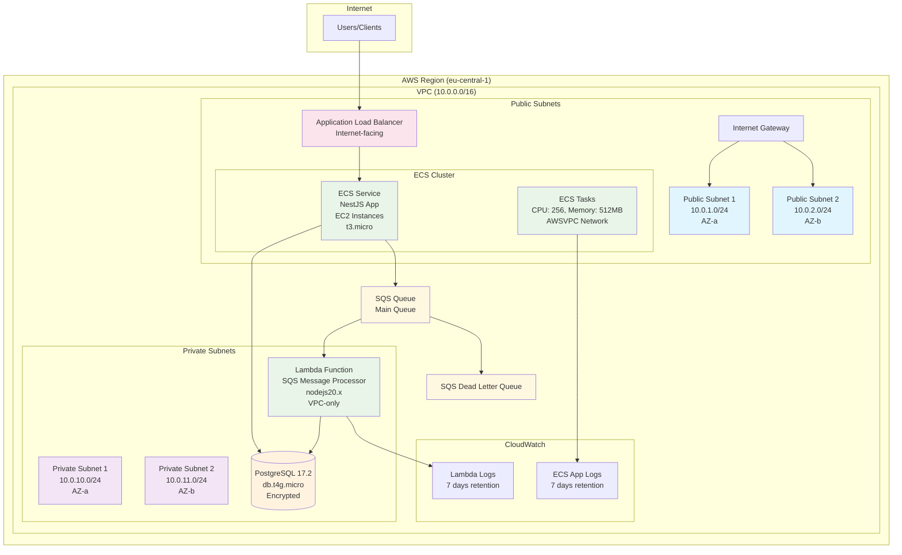

# HardverGo Infrastructure

This Terraform configuration deploys a scalable, production-ready infrastructure for the HardverGo application on AWS.

## Architecture Overview



## Infrastructure Components

### Networking
- **VPC**: Custom VPC with CIDR `10.0.0.0/16`
- **Public Subnets**: 2 subnets across different AZs for load balancer and ECS tasks
- **Private Subnets**: 2 subnets across different AZs for database and Lambda
- **Internet Gateway**: Provides internet access to public subnets
- **Route Tables**: Public subnets route to Internet Gateway

### Security Groups
- **ALB Security Group**: Allows HTTP (80) and HTTPS (443) from internet
- **ECS Tasks Security Group**: Allows traffic from ALB on application port
- **RDS Security Group**: Allows PostgreSQL (5432) from ECS tasks and Lambda
- **Lambda Security Group**: Outbound access for Lambda functions

### Application Layer
- **Application Load Balancer**: Internet-facing ALB distributing traffic
- **Target Group**: Health checks on `/health` endpoint
- **ECS Cluster**: Managed container orchestration with Container Insights
- **ECS Service**: Runs NestJS application on EC2 instances in public subnets
- **ECS Task Definition**: 
  - CPU: 256 units
  - Memory: 512 MB
  - AWSVPC networking mode
  - Direct port mapping (no host port needed)
  - Health checks and logging configured
- **EC2 Auto Scaling Group**: 
  - Instance type: t3.micro
  - Min: 1, Max: 3, Desired: 1
  - ECS-optimized Amazon Linux 2

### Database
- **RDS PostgreSQL**: 
  - Engine: PostgreSQL 17.2
  - Instance: db.t4g.micro
  - Storage: 20GB GP3 (auto-scaling to 100GB)
  - Encrypted at rest
  - Backup disabled (development setup)
  - Single-AZ deployment in private subnets

### Message Processing
- **SQS Queue**: Main message queue for asynchronous processing
- **Dead Letter Queue**: Handles failed messages (max 3 retries)
- **Lambda Function**: Processes SQS messages with database access (VPC-only, no internet access)
- **Event Source Mapping**: Triggers Lambda from SQS (batch size: 10)

### Monitoring & Logging
- **CloudWatch Log Groups**: 
  - ECS application logs (7-day retention)
  - Lambda function logs (7-day retention)
- **Container Insights**: ECS cluster monitoring enabled

### IAM Roles & Policies
- **ECS Task Execution Role**: ECR and CloudWatch Logs access
- **ECS Task Role**: SQS queue access permissions
- **Lambda Role**: VPC access, SQS processing, and database connectivity
- **ECS Instance Role**: EC2 Container Service permissions

## Prerequisites

1. **AWS CLI** configured with appropriate credentials
2. **Terraform** >= 1.0 installed
3. **Docker image** pushed to ECR (or other container registry)
4. **Database password** for RDS instance

## Configuration

### Required Variables

Copy `terraform.tfvars.example` to `terraform.tfvars` and configure:

```hcl
aws_region   = "eu-central-1"
project_name = "hardvergo"
environment  = "dev"

db_username = "postgres"
db_password = "your-secure-password-here"

app_image = "your-account-id.dkr.ecr.eu-central-1.amazonaws.com/hardvergo:latest"
app_port  = 80
```

### Environment Variables

The ECS task is configured with these environment variables:
- `NODE_ENV`: Environment (dev/staging/prod)
- `PORT`: Application port (80)
- `DB_HOST`: RDS endpoint
- `DB_NAME`: Database name (hardvergo)
- `DB_USERNAME`: Database username
- `DB_PASSWORD`: Database password
- `SQS_QUEUE_URL`: SQS queue URL for message processing

## Deployment

### Initial Setup

1. **Initialize Terraform**:
   ```bash
   terraform init
   ```

2. **Plan deployment**:
   ```bash
   terraform plan
   ```

3. **Apply configuration**:
   ```bash
   terraform apply
   ```

### Application Deployment

1. **Build and push Docker image**:
   ```bash
   # Build your NestJS application
   docker build -t hardvergo .
   
   # Tag and push to ECR
   docker tag hardvergo:latest your-account-id.dkr.ecr.eu-central-1.amazonaws.com/hardvergo:latest
   docker push your-account-id.dkr.ecr.eu-central-1.amazonaws.com/hardvergo:latest
   ```

2. **Update ECS service** (if image changes):
   ```bash
   terraform apply -var="app_image=your-account-id.dkr.ecr.eu-central-1.amazonaws.com/hardvergo:new-tag"
   ```

## Health Checks & Monitoring

### Application Health
- **ALB Target Group**: Health checks on `/health` endpoint
- **ECS Task**: Container health check via curl
- **Thresholds**: 2 healthy, 2 unhealthy checks

### Monitoring
- **CloudWatch Logs**: Application and Lambda logs
- **Container Insights**: ECS cluster metrics
- **ALB Metrics**: Request count, latency, error rates

## Security Features

- **Encrypted Storage**: RDS encryption at rest
- **Hybrid Networking**: ECS tasks in public subnets, database in private subnets
- **Security Groups**: Least-privilege network access (ECS tasks only accept ALB traffic)
- **IAM Roles**: Minimal required permissions
- **VPC**: Isolated network environment

## Scaling & Performance

### Auto Scaling
- **ECS Service**: Configurable desired count
- **RDS Storage**: Auto-scaling from 20GB to 100GB
- **ECS Capacity**: FARGATE_SPOT for cost optimization

### Performance Optimizations
- **Multi-AZ**: High availability across availability zones
- **Connection Pooling**: Configure in application for RDS
- **SQS Batching**: Lambda processes up to 10 messages per invocation

## Cost Optimization

- **No NAT Gateway**: Saves ~$45/month by using public subnets for ECS
- **EC2 over Fargate**: More cost-effective for consistent workloads
- **t3.micro instances**: Burstable performance at low cost (~$8.50/month)
- **Auto Scaling**: Scale down to 1 instance during low usage
- **GP3 Storage**: Better price-performance than GP2
- **Log Retention**: 7-day retention to minimize storage costs
- **VPC-only Lambda**: No internet access reduces potential egress costs

## Cleanup

To destroy the infrastructure:

```bash
terraform destroy
```

**Note**: The RDS database is configured for easy cleanup:
- `deletion_protection = false`: Allows Terraform to delete the database
- `skip_final_snapshot = true`: No final snapshot created during deletion
- All resources will be permanently deleted including the database and all data

## Outputs

After deployment, Terraform provides these outputs:
- `alb_dns_name`: Load balancer DNS for application access
- `rds_endpoint`: Database endpoint (sensitive)
- `sqs_queue_url`: Queue URL for message publishing
- `ecs_cluster_name`: ECS cluster name
- `lambda_function_name`: Lambda function name

## Troubleshooting

### Common Issues

1. **ECS Tasks not starting**:
   - Check CloudWatch logs for container errors
   - Verify ECR image accessibility
   - Confirm security group rules

2. **Database connection issues**:
   - Verify security group allows port 5432
   - Check RDS endpoint and credentials
   - Ensure tasks are in correct subnets

3. **Lambda function errors**:
   - Check CloudWatch logs for function errors
   - Verify VPC configuration and security groups
   - Confirm SQS permissions

### Useful Commands

```bash
# Check ECS service status
aws ecs describe-services --cluster hardvergo-dev-cluster --services hardvergo-dev-service

# View application logs
aws logs tail /ecs/hardvergo-dev-app --follow

# Test SQS queue
aws sqs send-message --queue-url <queue-url> --message-body '{"test": "message"}'
```

## Next Steps

1. **SSL/TLS**: Add ACM certificate and HTTPS listener
2. **Custom Domain**: Configure Route 53 for custom domain
3. **CI/CD Pipeline**: Set up automated deployments
4. **Monitoring**: Add CloudWatch alarms and SNS notifications
5. **Backup Strategy**: Implement automated RDS snapshots
6. **Secrets Management**: Use AWS Secrets Manager for sensitive data